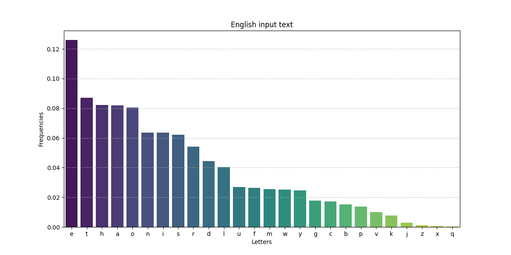
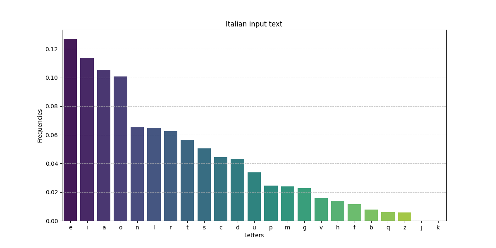

# Comments on letter frequency results

We analyzed the frequency of letters in **English**, **Italian**, **Hungarian**, and **Finnish** translations of the **Bible**: the results show interesting patterns that reflect the linguistic characteristics of each language.

## Individual Languages

### English
- **Most common letter:** 'e' (12.60%) - confirming its prevalence in English.
- **Other frequent letters:** 't' (8.70%), 'h' (8.21%), 'a' (8.20%), 'o' (8.05%).
- **Least common letters:** 'q' (0.03%), 'x' (0.05%), 'z' (0.10%).

### Italian
- **Most common letter:** 'e' (12.71%) - similar to English.
- **Other frequent letters:** 'i' (11.37%), 'a' (10.53%), 'o' (10.08%).
- **Least common letters:** 'k'and 'j' (almost absents), 'x' (absent).

### Hungarian
- **Most common letter:** 'e' (15.31%) - again.
- **Other frequent letters:** 'a' (12.79%).
- **Least common letters:** 'x' (almost absent), 'q' and 'w' (absents).

### Finnish
- **Most common letter:** 'a' (18.41%) - different from the other languages.
- **Other frequent letters:** 'n' (10.69%), 'i' (10.34%).
- **Least common letters:** 'f', 'x' and 'w' (almost absent).

## Comparisons Between Languages

1. **Dominance of 'e':** In English, Italian, and Hungarian, 'e' is the most common letter, reflecting a general trend in Western and Central European languages.

2. **Letter 'a':** In Finnish, 'a' is the most common letter (18.41%), indicating a significantly different vowel structure compared to the other languages.

3. **Variance in Consonant Frequency:**
   - **English:** Consonants like 'h' (8.21%) and 't' (8.70%) are quite common.
   - **Italian:** 't' (5.66%) and 'n' (6.53%) are frequent but less so compared to English.
   - **Hungarian:** 't' (7.44%) and 'k' (5.73%) show a different usage pattern.
   - **Finnish:** 't' (8.37%) and 'n' (10.69%) are very common, with 'k' (4.84%) also relatively high.

4. **Rare Letters:**
   - 'q', 'x', 'z', 'w' tend to be rare or absent in all languages.
   - Italian and Hungarian almost never use 'k'.
   - Finnish has a very low frequency of 'b' (0.21%) compared to other languages.

5. **Diversity in Less Common Letters:**
   - **English and Hungarian:** Use 'j' and 'y' more frequently compared to Italian and Finnish.
   - **Italian:** Has significant presence of 'c' (4.46%) and 'p' (2.44%) compared to other languages.

## Conclusion
The differences in letter frequency among these languages reflect their distinct phonetic and grammatical structures: the **high frequency of 'a' in Finnish** suggests a prevalence of words with this vowel, while English and Italian share a more **similar letter distribution**, with 'e' being dominant. Hungarian, with its complex morphology, shows a more **diverse frequency range**. 

These data are useful for understanding linguistic characteristics and can be applied in fields like computational linguistics, cryptography, and natural language processing.